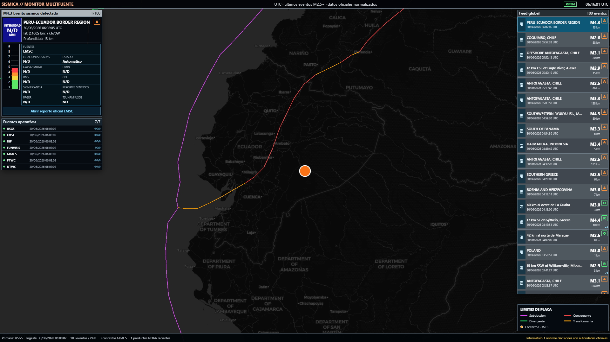
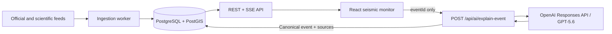

<div align="center">

# SISMICA GPT-5.6

**Multi-source seismic monitoring with evidence-grounded AI explanations.**

[](https://github.com/KamuiSenpai/sismica-gpt56-openai-build-week-2026/actions/workflows/ci.yml)


OpenAI Build Week 2026 submission by [KamuiSenpai](https://github.com/KamuiSenpai).

</div>



> The image above shows the base seismic monitor. Simulated UI captures are not presented as proof of a real OpenAI API call.

## Overview

SISMICA consolidates earthquake events from official and scientific feeds into a single operational monitor. The Build Week addition lets a user select one event and request a concise Spanish explanation from GPT-5.6 without turning the model into an alerting or prediction system.

En espanol: SISMICA integra fuentes sismicas, normaliza los eventos y permite solicitar una explicacion prudente de un evento concreto mediante GPT-5.6.

Development attribution: the project is led and authored by KamuiSenpai. AI-assisted work was performed primarily with ChatGPT/Codex (approximately 80%); Claude had a limited supporting role in earlier tasks and is not attributed as a Git co-author.

## Build Week focus

| Requirement                      | Implementation                                                             | Evidence                                                                                     |
| -------------------------------- | -------------------------------------------------------------------------- | -------------------------------------------------------------------------------------------- |
| New work during July 17-21, 2026 | Separate specification, API, web and evidence commits                      | [Build Week evidence guide](docs/build-week/EVIDENCE_GUIDE.md)                               |
| Codex development sessions       | Sanitized session record with branch, CLI version and decisions            | [Codex session evidence](docs/build-week/evidence/CODEX_SESSION_2026-07-17.md)               |
| Clear GPT-5.6 integration        | Database-grounded `POST /api/ai/explain-event` backed by the Responses API | [SDD-018](docs/specs/SDD-018_Explicador_Sismico_GPT-5.6_Build_Week.md)                       |
| Reproducible quality checks      | Typecheck, lint, API/worker/web tests and production build                 | [Validation report](docs/validation/VALIDATION-018_Explicador_Sismico_GPT-5.6_Build_Week.md) |

Core Build Week commits:

- [`5f15320`](https://github.com/KamuiSenpai/sismica-gpt56-openai-build-week-2026/commit/5f15320): GPT-5.6 specification and acceptance criteria.
- [`471cc1d`](https://github.com/KamuiSenpai/sismica-gpt56-openai-build-week-2026/commit/471cc1d): Responses API service, schema validation and tests.
- [`6a98924`](https://github.com/KamuiSenpai/sismica-gpt56-openai-build-week-2026/commit/6a98924): user-facing explanation panel and responsive behavior.
- [`05555fc`](https://github.com/KamuiSenpai/sismica-gpt56-openai-build-week-2026/commit/05555fc): evidence capture workflow and validation records.
- [`27c3cda`](https://github.com/KamuiSenpai/sismica-gpt56-openai-build-week-2026/commit/27c3cda): database grounding, OpenAI audit/cache, API security, materialized analytics and fixed stations.

## GPT-5.6 integration

The AI path is deliberately narrow and auditable:

1. The user explicitly requests an explanation for the selected event.
2. The browser sends only the canonical `eventId`; client-supplied seismic facts are rejected.
3. The API loads the current event and associated sources from PostgreSQL/PostGIS and hashes that grounded input.
4. The backend calls the OpenAI Responses API with `model: gpt-5.6`, `store: false` and a strict JSON Schema.
5. The output is validated again, cached by event version and recorded with model, `response_id`, token usage, latency and status.
6. The UI displays provider, model, `response_id`, database source count, cache state, input hash and a safety disclaimer.

The prompt forbids invented damage, victims, alerts, tectonic causes and predictions. The feature explains the supplied record; it does not issue emergency guidance or replace official authorities.

Key files:

- [`openaiExplainerService.ts`](apps/api/src/services/openaiExplainerService.ts)
- [`openaiExplanationRepository.ts`](apps/api/src/services/openaiExplanationRepository.ts)
- [`AiEventExplainer.tsx`](apps/web/src/components/AiEventExplainer.tsx)
- [`openaiExplainer.test.ts`](apps/api/test/openaiExplainer.test.ts)

## Architecture



```text
apps/api         REST, SSE, OpenAI integration and validation
apps/worker      Multi-source ingestion and event normalization
apps/web         React/Vite operational monitor
packages/shared  Shared contracts and utilities
db/migrations    PostgreSQL/PostGIS schema
docs             Specifications, validation and Build Week evidence
```

## Security and operations

- Helmet security headers, request IDs and explicit browser-origin rejection are applied globally.
- GPT-5.6 and local compute/TTS routes have independent per-IP rate limits.
- Runtime diagnostics, telemetry reads/deletes and YouTube operations require `API_OPERATOR_TOKEN`.
- The seismic-presence endpoint serves a PostgreSQL materialization instead of scanning every historical title. Use `npm run analytics:refresh` for a manual rebuild; the API also refreshes stale data in the background.
- GEOFON station coordinates are fixed catalog positions. SSE updates change status and phase only; computed experimental origins remain a separate data type.

## Run locally

### Requirements

- Node.js 22+
- npm 11+
- Docker with PostgreSQL/PostGIS, or an equivalent local instance

### Setup

```powershell
git clone https://github.com/KamuiSenpai/sismica-gpt56-openai-build-week-2026.git
Set-Location sismica-gpt56-openai-build-week-2026
npm ci
Copy-Item .env.example .env
docker compose up -d
npm run db:migrate
npm run analytics:refresh
```

Start each process in a separate terminal:

```powershell
npm run dev:api
npm run dev:worker
npm run dev:web
```

The web app uses `http://localhost:5173` and the API uses `http://localhost:3000` by default.

### Enable GPT-5.6

Set these values only in the ignored local `.env` file:

```dotenv
OPENAI_ENABLED=true
OPENAI_API_KEY=your_api_key
OPENAI_BASE_URL=https://api.openai.com/v1
OPENAI_MODEL=gpt-5.6
```

Open the monitor, select an event and choose **GPT-5.6 - Explicar este evento**. API keys stay on the backend and must never be committed or exposed in browser code.

For administrative diagnostics, generate a 24+ character secret and set `API_OPERATOR_TOKEN` only on the server. Do not place this token in Vite variables or browser code.

## Quality

Run the same checks used by GitHub Actions:

```powershell
npm run verify
```

The verification pipeline currently covers 51 API, 52 worker and 109 web tests, plus TypeScript, ESLint and production builds. The Build Week evidence collector can also record dated commits, canonical grounding and a real OpenAI `response_id` without reading or storing the API key:

```powershell
node scripts/capture-build-week-evidence.mjs --session-id=<codex-session-id>
```

Generated evidence is written to the ignored `output/build-week/` directory for review before sharing.

## Current evidence status

- Code integration, automated tests, responsive UI validation and Codex session evidence are complete.
- A real OpenAI response is intentionally marked pending until the local environment has an enabled key with usable API quota.
- Playwright screenshots that use route interception validate presentation only and are not API-consumption evidence.

## Data and safety

SISMICA consumes external seismic and geospatial sources. Availability, accuracy and usage terms remain the responsibility of each provider. The application is informational and does not replace official earthquake or tsunami authorities.

No software license has been granted in this repository. Third-party data, map assets, audio and service names retain their respective rights and terms.
